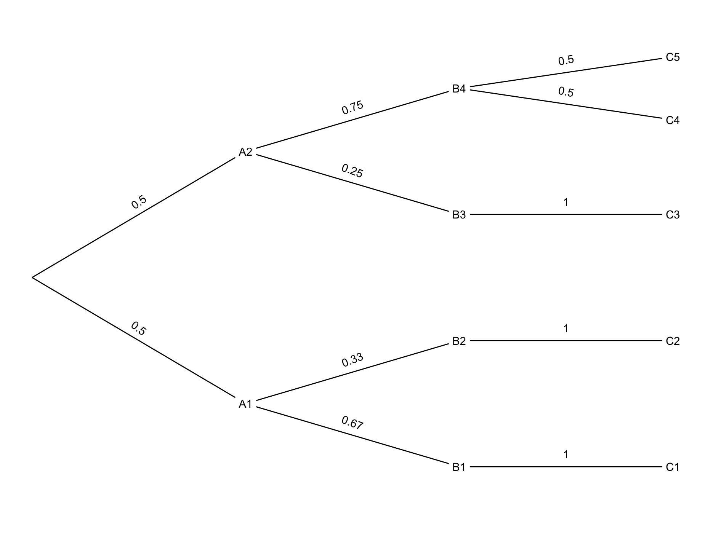

# The ptree R package

The `ptree` package makes it easy to draw probability trees in R. Turn this:

```r
nodes <- bind_rows(
  list(text = "A1", parent = 0, p = 1/2),
  list(text = "B1", parent = 1, p = 2/3),
  list(text = "C1", parent = 2, p = 1  ),
  list(text = "B2", parent = 1, p = 1/3),
  list(text = "C2", parent = 4, p = 1  ),
  list(text = "A2", parent = 0, p = 1/2),
  list(text = "B3", parent = 6, p = 1/4),
  list(text = "C3", parent = 7, p = 1  ),
  list(text = "B4", parent = 6, p = 3/4),
  list(text = "C4", parent = 9, p = 1/2),
  list(text = "C5", parent = 9, p = 1/2)
)
```

into this:



It's intended for use with `ggplot2`, but can be used with other plotting systems too. 


## How It Works

You specify a set of nodes: what text to display, and the parent node. You can also specify a (conditional) probability for each node, which will display on the corresponding edge in the tree.

Then `ptree` lays out the tree. It computes *x*- and *y*-coordinates for the nodes, the start- and endpoints of the edges, and the probabilities (if included).

A helper function can also do the work of drawing the tree for you, if you don't want to bother with the calls to ggplot2 yourself. This:

```r
nodes <- compute_tree(nodes)
draw_tree(nodes)
```

is short for this:

```r
nodes <- compute_tree(nodes)
ggplot(nodes) + theme_void() +
  xlim(0,1) + ylim(0,1) +
  geom_segment(aes(x = x, y = y, xend = xend, yend = yend)) +  
  geom_label(aes(x = x, y = y, label = text), label.size = NA) +
  geom_text(aes(x = p_x, y = p_y, label = p, angle = p_angle))

```

# TODO

1. ~~Make p column optional~~ ✓
2. ~~Add option for id column~~ ✓
3. Add option for leaf probabilities
4. Add option to compute leaf probabilities
    - Including ability to concatenate string probabilities
5. Add option for leaf markers
6. Add option to mathify labels
